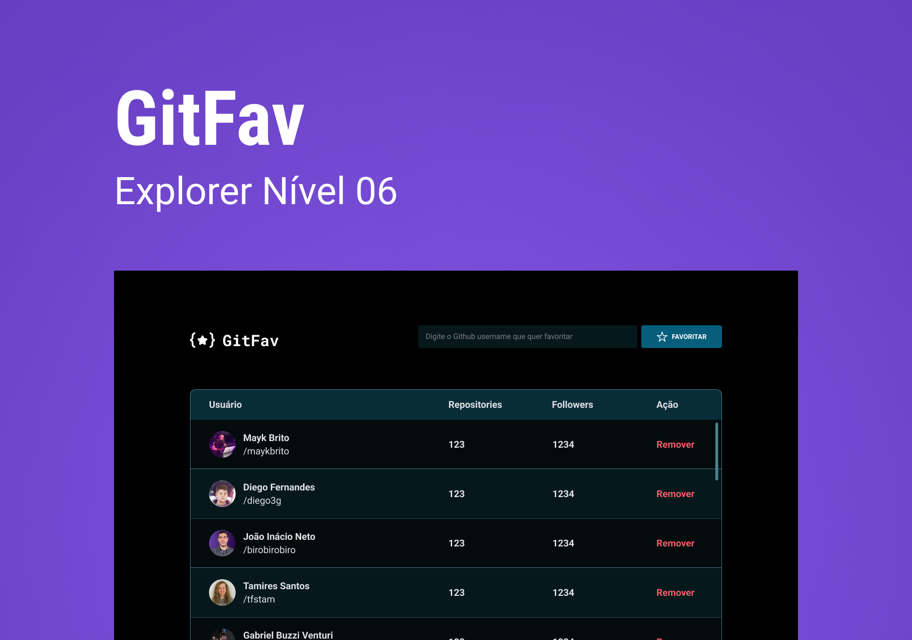

<h1 align="center"> Git-Fav </h1>

Projeto exclusivo e gratuito, promovido pela Rocketseat para ensino de tecnologias WEB.  

  <a href="#-tecnologias">Tecnologias</a>&nbsp;&nbsp;&nbsp;|&nbsp;&nbsp;&nbsp;
  <a href="#-projeto">Projeto</a>&nbsp;&nbsp;&nbsp;|&nbsp;&nbsp;&nbsp;
  <a href="#-layout">Layout</a>&nbsp;&nbsp;&nbsp;|&nbsp;&nbsp;&nbsp;
  <a href="#memo-licença">Licença</a>

  

 

  

## 🚀 Tecnologias

Esse projeto foi desenvolvido com as seguintes tecnologias:

- HTML e CSS
- JavaScript
- Git e Github
- Figma

## 💻 Projeto

O Git-fav é um projeto pensado para me desenvolver e explorar ferramentas disponivéis no javaScript. Consiste em criar uma lista pessoal atráves de uma tabela com seus perfis de Github favoritos guardando-os no localhost e preenchendo os dados da tabela consumindo o API do Github. Fiz algumas mudanças sutis no projeto original para que ele fique ainda mais objetivo e eficiente para o úsuario.

## 🔖 Layout

Você pode visualizar o layout do projeto através [DESSE LINK](https://www.figma.com/file/smyfQxv97wDFAoUO03Jl2f/%5BDesafios-Explorer%5D-GitFav-(Copy)-(Copy)?type=design&node-id=104%3A48&mode=design&t=btj835omlxlrMAuI-1). É necessário ter conta no [Figma](https://figma.com) para acessá-lo.

## :memo: Licença

Esse projeto está sob a licença MIT.
